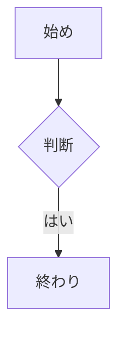
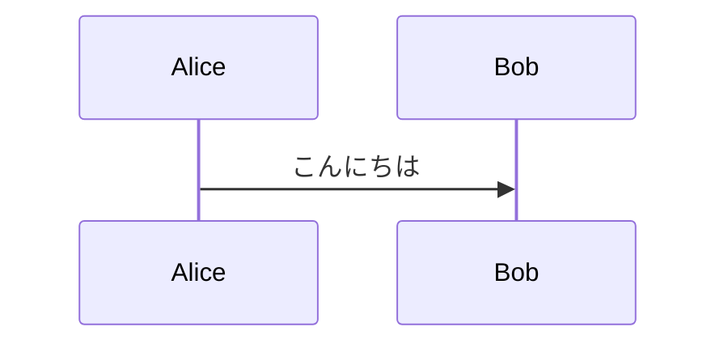

文中の数式 $`a^2 + b^2 = c^2`$ と、ドルだけの $x + y$ と、金額の $5 と $10。

$$
\sum_{i=1}^{n} i = \frac{n(n+1)}{2}
$$

段落の中の $$ E = mc^2 $$ の形。

```math
\int_0^1 x^2 dx
```


```mermaid
graph TD;
  A[始め] --> B{判断};
  B -->|はい| C[終わり];
```


```mermaid
sequenceDiagram
  Alice->>Bob: こんにちは
```
